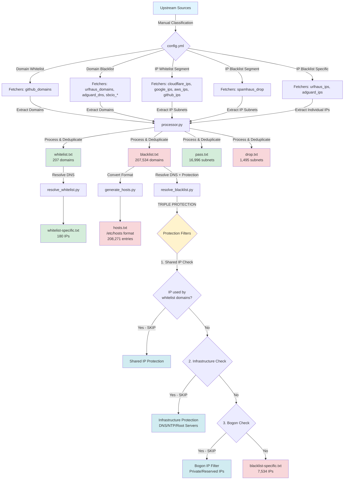

# Pangrosan Security Data Aggregator - Data Flow Documentation

## 📊 Complete Data Flow Diagram



## 🔄 Data Flow Steps

### 1. **Upstream Classification** (Manual)
**File:** `config.yml`

Upstream sources are manually classified into categories:

- **Domain Whitelist** → `domain_whitelist` sources
- **Domain Blacklist** → `domain_blacklist` sources
- **IP Whitelist Segment** → `ip_whitelist_segment` sources
- **IP Blacklist Segment** → `ip_blacklist_segment` sources
- **IP Blacklist Specific** → `ip_blacklist_specific` sources

### 2. **Data Extraction** (Automated)
**Tool:** `scripts/fetchers/*.py`

Each fetcher extracts data from upstream sources:

| Fetcher | Input | Output | Type |
|---------|-------|--------|------|
| `github_domains.py` | GitHub API | Domains | Whitelist |
| `urlhaus_domains.py` | URLhaus CSV | Malware domains | Blacklist |
| `adguard_dns.py` | AdGuard Filter | Ad/tracker domains | Blacklist |
| `sbcio_gambling_porn.py` | StevenBlack hosts | Gambling/porn domains | Blacklist |
| `sbcio_fakenews.py` | StevenBlack hosts | Fake news domains | Blacklist |
| `cloudflare_ips.py` | Cloudflare API | IP subnets | Whitelist |
| `google_ips.py` | Google API | IP subnets | Whitelist |
| `aws_ips.py` | AWS JSON | IP subnets | Whitelist |
| `github_ips.py` | GitHub API | IP subnets | Whitelist |
| `spamhaus_drop.py` | Spamhaus DROP | Malicious subnets | Blacklist |
| `urlhaus_ips.py` | URLhaus CSV | Malware IPs | Blacklist |
| `adguard_ips.py` | AdGuard Filter | Ad/tracker IPs | Blacklist |

### 3. **Data Processing** (Automated)
**Tool:** `scripts/processor.py`

**Processing steps:**
1. Load configuration from `config.yml`
2. For each category:
   - Load fetcher module dynamically
   - Execute fetcher to get data
   - Store in dict format: `{entry: source_name}`
3. **Append mode**: Merge with existing data (preserves manual entries)
4. **Cross-check**: Remove blacklist domains that exist in whitelist
5. **IPv6 Support**:
   - Detect IP version (IPv4 vs IPv6)
   - Add appropriate prefix: `/32` for IPv4, `/128` for IPv6
6. **Sorting**:
   - IP files: Numerical sorting (IPv4 first, then IPv6)
   - Domain files: Alphabetical sorting
7. Write to output files with source comments

**Output files:**
- `data/whitelist.txt` - 207 whitelist domains
- `data/blacklist.txt` - 207,534 blacklist domains
- `data/pass.txt` - 16,996 IP subnets (whitelist)
- `data/drop.txt` - 1,495 IP subnets (blacklist)

### 4. **Hosts File Generation** (Automated)
**Tool:** `scripts/generate_hosts.py`

**Process:**
1. Read `data/blacklist.txt`
2. Filter out wildcard domains (e.g., `*.example.com`)
3. Convert to `/etc/hosts` format: `0.0.0.0 domain.tld`
4. Write to `data/hosts.txt`

**Output:**
- `data/hosts.txt` - 208,271 entries in `/etc/hosts` format

### 5. **DNS Resolution** (Automated)
**Tools:**
- `scripts/resolve_whitelist.py` - Resolve whitelist domains
- `scripts/resolve_blacklist.py` - Resolve blacklist domains with protection

#### 5.1. Whitelist Resolution
**Process:**
1. Read domains from `data/whitelist.txt`
2. Resolve to IP addresses using `DNSResolver`
3. Add to `data/whitelist-specific.txt`

**Output:**
- `data/whitelist-specific.txt` - 180 IPs from whitelist domains

#### 5.2. Blacklist Resolution with TRIPLE PROTECTION
**Process:**
1. Read domains from `data/blacklist.txt`
2. Resolve whitelist domains first to get shared IPs
3. For each blacklist domain:
   - Resolve to IP addresses
   - Apply **TRIPLE PROTECTION**:

##### 🛡️ PROTECTION 1: Shared IP Check
**Purpose:** Prevent blocking CDN/hosting platforms

**Example:** `sidebar-pdf-preview.netlify.app`
- Malicious site uses Netlify (shared IP: `13.215.239.219`)
- Legitimate site `preview.netlify.app` uses same IP
- **Action:** SKIP this IP from blacklist

**Statistics:** Typically skips 1,000+ shared IPs

##### 🛡️ PROTECTION 2: Infrastructure Protection (CRITICAL!)
**Purpose:** Never block critical internet infrastructure

**Protected IPs:**
- DNS servers: `1.1.1.1`, `8.8.8.8`, `8.8.4.4`, etc.
- Root DNS servers: A-M.ROOT-SERVERS.NET
- NTP servers: time.nist.gov, pool.ntp.org
- Cloudflare DNS: `1.0.0.1`, `1.1.1.1`
- Google DNS: `8.8.8.8`, `8.8.4.4`

**Action:** 🚨 Log warning and SKIP

##### 🛡️ PROTECTION 3: Bogon IP Filtering
**Purpose:** Filter invalid/private/reserved IPs

**Filtered IPs:**
- `0.0.0.0` (invalid/unspecified)
- `127.0.0.0/8` (loopback)
- `10.0.0.0/8` (private Class A)
- `172.16.0.0/12` (private Class B)
- `192.168.0.0/16` (private Class C)
- `169.254.0.0/16` (link-local/APIPA)
- `224.0.0.0/4` (multicast)
- `240.0.0.0/4` (reserved)
- `255.255.255.255` (broadcast)

**Action:** SKIP with debug log

4. Add surviving IPs to `data/blacklist-specific.txt`

**Output:**
- `data/blacklist-specific.txt` - 7,534 IPs (after protection)

**Protection Statistics Example:**
```
Protection Statistics:
  - Shared IPs skipped: 1,245
  - Infrastructure IPs skipped: 12 🛡️
  - Bogon/Reserved IPs skipped: 3,567
  - Total protected: 4,824
```

### 6. **Deduplication** (Automated)

#### 6.1. Within-File Deduplication
**Mechanism:** Python `dict` data structure
- Dict keys are unique
- Duplicate entries automatically overridden
- Latest source info preserved

**Example:**
```python
data = {}
data["1.2.3.4"] = "URLhaus Malware IPs"  # First entry
data["1.2.3.4"] = "AdGuard DNS Filter"   # Override (latest wins)
# Result: {"1.2.3.4": "AdGuard DNS Filter"}
```

#### 6.2. Cross-Category Deduplication
**Rule:** Whitelist has PRIORITY over blacklist

**Process:**
1. Before writing `blacklist.txt`, check against `whitelist.txt`
2. Remove any domains that exist in whitelist
3. Log removal count

**Example:**
```
Cross-check whitelist: 37 domain dihapus dari blacklist
```

**Implementation:** `processor.py` → `remove_whitelisted_domains()`

#### 6.3. DNS Resolution Deduplication
**Auto-cleanup of outdated IPs:**

**Process:**
1. Read existing `*-specific.txt` files
2. Identify IPs with marker: `"Berasal dari IP domain"`
3. Check if domain still in blacklist/whitelist
4. Remove IPs from domains no longer in list
5. Keep manual IPs (without marker) intact

**Example:**
```
Removing outdated IP 1.2.3.4 (Berasal dari IP domain old-malware.com)
```

## 📁 File Structure Summary

### Input Files
- `config.yml` - Source definitions and settings
- Upstream sources (fetched via HTTP/API)

### Processing Scripts
- `scripts/processor.py` - Main data processor
- `scripts/fetchers/*.py` - Data extraction from upstreams
- `scripts/resolve_blacklist.py` - DNS resolution with protection
- `scripts/resolve_whitelist.py` - DNS resolution for whitelist
- `scripts/generate_hosts.py` - Hosts file generator
- `scripts/dns_resolver.py` - Optimized DNS resolver (100 concurrent threads)

### Output Files

#### Domain Files
| File | Type | Format | Count | Purpose |
|------|------|--------|-------|---------|
| `whitelist.txt` | Domain | `domain # Source` | 207 | Trusted domains |
| `blacklist.txt` | Domain | `domain # Source` | 207,534 | Malicious domains |
| `hosts.txt` | Domain | `0.0.0.0 domain` | 208,271 | /etc/hosts format |

#### IP Files (Specific)
| File | Type | Format | Count | Purpose |
|------|------|--------|-------|---------|
| `whitelist-specific.txt` | IPv4/IPv6 | `IP/prefix # Source` | 180 | Individual trusted IPs |
| `blacklist-specific.txt` | IPv4/IPv6 | `IP/prefix # Source` | 7,534 | Individual malicious IPs |

#### IP Files (Segment)
| File | Type | Format | Count | Purpose |
|------|------|--------|-------|---------|
| `pass.txt` | IPv4/IPv6 | `CIDR # Source` | 16,996 | Trusted subnets |
| `drop.txt` | IPv4/IPv6 | `CIDR # Source` | 1,495 | Malicious subnets |

### CIDR Prefix Rules
- **IPv4 Individual**: `/32` (e.g., `1.2.3.4/32`)
- **IPv6 Individual**: `/128` (e.g., `2001:db8::1/128`)
- **IPv4 Subnets**: Variable (e.g., `/24`, `/16`, `/8`)
- **IPv6 Subnets**: Variable (e.g., `/64`, `/48`, `/32`)

## 🔧 Configuration

### Mode Setting (`config.yml`)
```yaml
settings:
  mode: "append"              # append = keep manual entries, replace = overwrite all
  remove_duplicates: true     # automatic via dict structure
  sort_output: true           # numerical for IPs, alphabetical for domains
```

### Append Mode Benefits
1. ✅ Preserves manual entries (Linux repos, custom domains)
2. ✅ Merges new data with existing
3. ✅ Updates source info for existing entries
4. ✅ No data loss during updates

### Replace Mode (Use with caution!)
1. ⚠️ Removes ALL existing data
2. ⚠️ Only keeps data from configured sources
3. ⚠️ Manual entries will be lost
4. ⚠️ Use only for complete rebuild

## 🚀 Running the System

### Full Pipeline
```bash
# 1. Fetch and process all data
python3 scripts/processor.py

# 2. Generate hosts file
python3 scripts/generate_hosts.py

# 3. Resolve whitelist domains to IPs
python3 scripts/resolve_whitelist.py

# 4. Resolve blacklist domains to IPs (with protection)
python3 scripts/resolve_blacklist.py
```

### Individual Components
```bash
# Only fetch new data (append mode)
python3 scripts/processor.py

# Only regenerate hosts file
python3 scripts/generate_hosts.py

# Only resolve DNS (whitelist)
python3 scripts/resolve_whitelist.py

# Only resolve DNS (blacklist with protection)
python3 scripts/resolve_blacklist.py
```

## 📊 Statistics (Current State)

| Metric | Count | Notes |
|--------|-------|-------|
| **Domains** |
| Whitelist domains | 207 | GitHub + Linux repos + Hosting platforms |
| Blacklist domains | 207,534 | Malware + Ads + Trackers + Gambling + Fake news |
| Hosts entries | 208,271 | Blacklist in /etc/hosts format |
| **IPs** |
| Whitelist IPs (specific) | 180 | From whitelist domain resolution |
| Blacklist IPs (specific) | 7,534 | From blacklist domain resolution (after protection) |
| Whitelist subnets | 16,996 | Cloudflare, Google, AWS, GitHub |
| Blacklist subnets | 1,495 | Spamhaus DROP |
| **Protection** |
| Shared IPs protected | ~1,245 | CDN/Hosting platforms |
| Infrastructure IPs protected | ~12 | DNS/NTP/Root servers |
| Bogon IPs filtered | ~3,567 | Private/Reserved ranges |
| **IPv6 Support** |
| IPv6 subnets (whitelist) | 4,433 | AWS, Google, Cloudflare, GitHub |
| IPv6 individual (whitelist) | 17 | Individual IPv6 addresses with /128 |

## 🛡️ Security Features

### 1. Infrastructure Protection
- ✅ DNS servers (1.1.1.1, 8.8.8.8, etc.)
- ✅ Root DNS servers (A-M.ROOT-SERVERS.NET)
- ✅ NTP servers (time.nist.gov, etc.)
- ✅ Never blacklisted under ANY circumstances

### 2. Shared IP Protection
- ✅ Detects CDN/hosting platforms (Netlify, Vercel, Cloudflare, etc.)
- ✅ Prevents false positives from shared infrastructure
- ✅ Cross-references whitelist domain IPs
- ✅ Example: `sidebar-pdf-preview.netlify.app` case resolved

### 3. Bogon IP Filtering
- ✅ Filters private IP ranges (RFC 1918)
- ✅ Filters loopback addresses
- ✅ Filters link-local addresses
- ✅ Filters multicast/reserved ranges

### 4. Whitelist Priority
- ✅ Whitelist always overrides blacklist
- ✅ Prevents accidental blocking of critical services
- ✅ Cross-category deduplication

### 5. IPv6 Support
- ✅ Full dual-stack support (IPv4 + IPv6)
- ✅ Correct CIDR prefixes (/32 for IPv4, /128 for IPv6)
- ✅ Numerical sorting (IPv4 first, then IPv6)
- ✅ Handles IPv6 :: abbreviation

## 📝 Data Format Standards

### Domain Files
```
# Comment line
domain.tld # Source Name
*.wildcard.domain # Source Name  # Wildcard support
```

### IP Files (Specific)
```
# Comment line
1.2.3.4/32 # Source Name                    # IPv4 individual
2001:db8::1/128 # Source Name                # IPv6 individual
```

### IP Files (Segment)
```
# Comment line
10.0.0.0/8 # Source Name                    # IPv4 subnet
2001:db8::/32 # Source Name                  # IPv6 subnet
```

### Hosts File
```
# Comment line
0.0.0.0 malware.com
0.0.0.0 phishing.site
```

## 🔄 Update Frequency

Recommended update schedule:
- **Hourly**: DNS resolution (IP addresses change frequently)
- **Daily**: Domain blacklist (new malware appears daily)
- **Weekly**: IP subnets (infrastructure changes slowly)
- **Monthly**: Whitelist (trusted infrastructure rarely changes)

## ⚠️ Important Notes

1. **Always use append mode** unless doing a complete rebuild
2. **Run DNS resolution after domain updates** to keep IPs current
3. **Monitor protection statistics** to ensure shared IP protection is working
4. **Check logs for infrastructure warnings** (🚨 PROTECTED messages)
5. **Verify whitelist.txt** contains Linux repos and critical infrastructure
6. **Test before deployment** to avoid blocking critical services

## 🆘 Troubleshooting

### Linux repositories getting blocked?
✅ Check `data/whitelist.txt` contains repository domains
✅ Run `scripts/processor.py` to update whitelist-specific.txt
✅ Verify mode is "append" in config.yml

### CDN/Hosting platform blocked?
✅ Check shared IP protection statistics
✅ Verify resolve_blacklist.py has TRIPLE PROTECTION enabled
✅ Add platform domains to whitelist.txt if needed

### DNS servers getting blocked?
🚨 **CRITICAL**: This should NEVER happen
✅ Check infrastructure protection in resolve_blacklist.py
✅ Verify whitelist-specific.txt contains DNS server IPs
✅ Check logs for "PROTECTED" warnings

### Duplicates in files?
✅ Dict structure prevents duplicates automatically
✅ Check if same entry has different sources (latest wins)
✅ Cross-category duplicates removed by whitelist priority

---

**Generated:** 2025-12-07
**Version:** 2.0 (IPv6 Support + Triple Protection)
**System:** Pangrosan Security Data Aggregator
