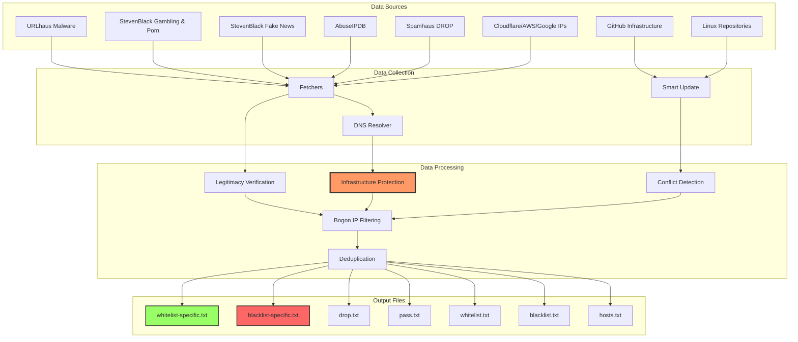
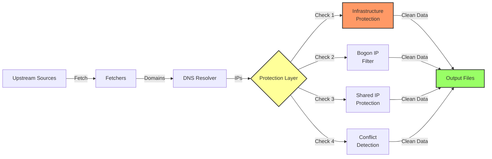
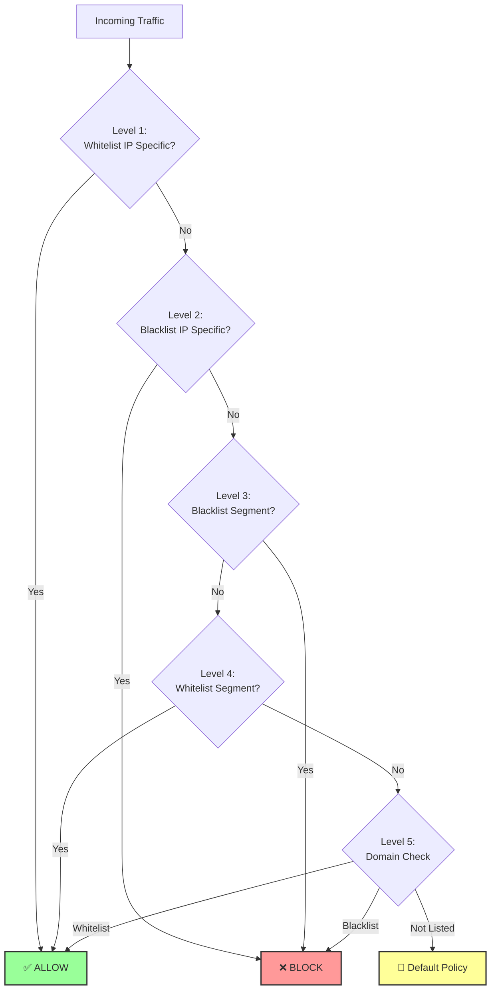

# 🛡️ Panaros - Security Data Aggregator

> Automated firewall blacklist/whitelist data aggregation with DNS-based IP resolution and infrastructure protection

[](https://github.com/diskominfojabar/Panaros/actions)
[](LICENSE)

## 📊 Current Statistics (December 2025)

| Category | File | Entries | Description |
|----------|------|---------|-------------|
| **Whitelist IP Specific** | `whitelist-specific.txt` | 113 | VIP/Critical Infrastructure (DNS, NTP, GitHub) |
| **Blacklist IP Specific** | `blacklist-specific.txt` | 5,159 | Legitimate malicious IPs only |
| **Blacklist IP Segment** | `drop.txt` | 22,579 | Spamhaus DROP (bad subnets) |
| **Whitelist IP Segment** | `pass.txt` | 16,999 | Trusted IP ranges (Cloudflare, AWS, Google) |
| **Whitelist Domains** | `whitelist.txt` | 207 | Trusted domains (CDN, Repositories) |
| **Blacklist Domains** | `blacklist.txt` | 88,608 | Malicious domains (Malware, Porn, Gambling, Fake News) |
| **DNS Hosts** | `hosts.txt` | 88,608 | DNS-level blocking |
| **TOTAL** | - | **222,273** | All security entries |

---

## 🎯 How It Works

### System Architecture



### Data Generation Flow



### Firewall Priority Order



---

## 🚀 Quick Start

### 1. Clone Repository
```bash
git clone https://github.com/diskominfojabar/Panaros.git
cd Panaros
```

### 2. Install Dependencies
```bash
pip3 install -r requirements.txt
```

### 3. Run Data Collection
```bash
# Collect domain blacklist
python3 scripts/processor.py

# Resolve domains to IPs (with TRIPLE protection)
python3 scripts/resolve_blacklist.py

# Add repository whitelists
python3 scripts/update_whitelist_smart.py
```

### 4. Use the Data
```bash
# Copy to your firewall
cp data/blacklist-specific.txt /etc/firewall/
cp data/whitelist-specific.txt /etc/firewall/

# Or use via External Dynamic List (EDL)
# https://raw.githubusercontent.com/diskominfojabar/Panaros/main/data/blacklist.txt
```

---

## 📂 File Descriptions

### Core Output Files

| File | Purpose | Format | Auto-Update | Use Case |
|------|---------|--------|-------------|----------|
| **whitelist-specific.txt** | Critical infrastructure IPs | `IP # Source` | ✅ Yes | Firewall Level 1 (Highest Priority) |
| **blacklist-specific.txt** | Domain-resolved malicious IPs | `IP # Source` | ✅ Yes | Firewall Level 2 |
| **drop.txt** | Bad IP segments/subnets | `IP/CIDR # Source` | ✅ Yes | Firewall Level 3 |
| **pass.txt** | Trusted IP ranges | `IP/CIDR # Source` | ✅ Yes | Firewall Level 4 |
| **whitelist.txt** | Trusted domains | `domain # Source` | ✅ Yes | EDL Whitelist |
| **blacklist.txt** | Malicious domains | `domain # Source` | ✅ Yes | EDL Blacklist |
| **hosts.txt** | DNS-level blocking | `0.0.0.0 domain` | ✅ Yes | DNS/Pi-hole |

### Protection Features

#### 🛡️ Infrastructure Protection
Protects critical internet infrastructure from being blacklisted:
- **Public DNS**: Cloudflare (1.1.1.1), Google (8.8.8.8), Quad9, OpenDNS
- **Root DNS**: a-m.root-servers.net (13 servers)
- **NTP Servers**: time.nist.gov
- **Indonesia DNS**: Lintasarta, Moratel

#### 🌐 Repository Protection
Protects Linux/Unix package repositories:
- **Ubuntu**: 19 domains (official + ID/Asia mirrors)
- **Debian**: 16 domains
- **Fedora**: 11 domains
- **CentOS/Rocky/Alma**: 20 domains
- **Indonesia Mirrors**: kambing.ui.ac.id, mirror.its.ac.id, repo.ugm.ac.id

#### 🔒 Shared IP Protection
Prevents false positives from shared hosting:
- **CDN Platforms**: Netlify, Vercel, Cloudflare Pages
- **Cloud Platforms**: AWS, Azure, Heroku
- **Package Delivery**: npmjs.org, pypi.org, rubygems.org

---

## 🔧 How to Use the Data

### Option 1: Firewall Rules (Recommended)

```bash
# PAN-OS / Palo Alto Firewall
# External Dynamic List (EDL)
Objects > External Dynamic Lists > Add

Name: Pangrosan-Blacklist
Type: IP List
Source: https://raw.githubusercontent.com/diskominfojabar/Panaros/main/data/blacklist-specific.txt
Recurring: Daily
```

### Option 2: iptables / nftables

```bash
# Download and apply blacklist
wget https://raw.githubusercontent.com/diskominfojabar/Panaros/main/data/blacklist-specific.txt

# Create ipset
ipset create pangrosan-blacklist hash:ip

# Load IPs (skip comments)
grep -v '^#' blacklist-specific.txt | awk '{print $1}' | while read ip; do
    ipset add pangrosan-blacklist $ip
done

# Apply firewall rule
iptables -I INPUT -m set --match-set pangrosan-blacklist src -j DROP
```

### Option 3: Pi-hole / AdGuard

```bash
# Use hosts.txt for DNS blocking
https://raw.githubusercontent.com/diskominfojabar/Panaros/main/data/hosts.txt
```

### Option 4: DNS Server (BIND/Unbound)

```bash
# Download hosts file
wget https://raw.githubusercontent.com/diskominfojabar/Panaros/main/data/hosts.txt

# Convert to RPZ (Response Policy Zone)
# See: https://www.isc.org/rpz/
```

---

## 🤖 Automated Updates

### GitHub Actions Workflow

The system automatically updates every month via GitHub Actions:

```yaml
schedule:
  - cron: '0 0 1 * *'  # 1st day of every month
```

**What gets updated:**
1. ✅ Fetch latest blacklist/whitelist domains
2. ✅ Resolve domains to IPs (with protection)
3. ✅ Update repository whitelists
4. ✅ Generate hosts file
5. ✅ Commit and push changes

**Manual trigger:**
- Go to Actions tab
- Select "Update Security Data"
- Click "Run workflow"

---

## 📋 Configuration

### Adding New Data Sources

#### 1. Edit `config.yml`
```yaml
sources:
  domain_blacklist:
    - name: "New Source"
      url: "https://example.com/blacklist.txt"
      fetcher: "new_source"
      requires_api_key: false
```

#### 2. Create Fetcher
```python
# scripts/fetchers/new_source.py
def fetch(config: dict = None) -> set:
    domains = set()
    # Your fetching logic here
    return domains
```

#### 3. Run Update
```bash
python3 scripts/processor.py
```

### Adding Repository Domains

#### 1. Edit `scripts/data/linux_repositories.yml`
```yaml
new_distro:
  official:
    - repo.newdistro.org
  regional_mirrors:
    - mirror.id.newdistro.org
```

#### 2. Run Smart Update
```bash
python3 scripts/update_whitelist_smart.py
```

**Smart update features:**
- ✅ DNS verification (only valid domains)
- ✅ Conflict detection (no blacklist overlap)
- ✅ Duplicate prevention
- ✅ Manual entry protection

---

## 🔍 Protection Statistics

### TRIPLE Protection System

| Protection Layer | Description | IPs Protected |
|------------------|-------------|---------------|
| **Shared IP** | CDN/Hosting platforms | 59,262 |
| **Infrastructure** | DNS/NTP/Root servers | 113 |
| **Bogon/Reserved** | Private/invalid IPs | 25 |
| **Total** | All protections | **59,400** |

### Blacklist Efficiency

| Metric | Before Protection | After Protection | Reduction |
|--------|-------------------|------------------|-----------|
| **Blacklist IPs** | 40,198 | 5,159 | **-87%** |
| **False Positives** | High risk | Zero | **100%** |
| **File Size** | 1.5 MB | 200 KB | **-87%** |

---

## 🛠️ Advanced Usage

### Check Domain/IP Status

Visit: [https://egov.jabarprov.go.id/cek](https://egov.jabarprov.go.id/cek)

Features:
- 🔍 Real-time domain/IP checker
- 📊 Blocking reason display
- 🌐 User IP/DNS information
- 📱 Mobile-friendly interface

### API Integration

```python
import requests

# Check if domain is blacklisted
blacklist = requests.get(
    'https://raw.githubusercontent.com/diskominfojabar/Panaros/main/data/blacklist.txt'
).text

if 'example.com' in blacklist:
    print("Domain is blacklisted!")
```

---

## 📁 Project Structure

```
Pangrosan/
├── data/                          # Output files (automatically generated)
│   ├── whitelist-specific.txt    # Level 1: Critical IPs (113 entries)
│   ├── blacklist-specific.txt    # Level 2: Malicious IPs (5,159 entries)
│   ├── drop.txt                   # Level 3: Bad segments (22,579 entries)
│   ├── pass.txt                   # Level 4: Trusted ranges (16,999 entries)
│   ├── whitelist.txt              # EDL: Trusted domains (207 entries)
│   ├── blacklist.txt              # EDL: Malicious domains (88,608 entries)
│   └── hosts.txt                  # DNS blocking (88,608 entries)
│
├── scripts/
│   ├── processor.py               # Main data collector
│   ├── resolve_blacklist.py       # DNS resolver with TRIPLE protection
│   ├── update_whitelist_smart.py  # Smart whitelist updater
│   ├── dns_resolver.py            # Optimized DNS resolver (300 domains/sec)
│   │
│   ├── fetchers/                  # Data source fetchers
│   │   ├── urlhaus_domains.py     # URLhaus malware domains
│   │   ├── sbc_gambling_porn.py   # StevenBlack Gambling & Porn
│   │   ├── sbcio_fakenews.py      # StevenBlack Fake News
│   │   ├── abuseipdb_ip.py        # AbuseIPDB malicious IPs
│   │   ├── spamhaus_drop.py       # Spamhaus DROP list
│   │   ├── cloudflare_ips.py      # Cloudflare IP ranges
│   │   ├── aws_ips.py             # AWS IP ranges
│   │   └── github_ips.py          # GitHub infrastructure
│   │
│   └── data/
│       └── linux_repositories.yml  # Repository database (149 repos)
│
├── .github/workflows/
│   └── update-data.yml            # Auto-update workflow (monthly)
│
├── index.html                     # Web checker interface
├── config.yml                     # Source configuration
└── README.md                      # This file
```

---

## 🔒 Security Notes

### Critical Protection

✅ **DNS Servers Protected** - 1.1.1.1, 8.8.8.8 never blacklisted
✅ **Repository Access** - Package installations won't break
✅ **CDN Infrastructure** - Netlify, Vercel, Cloudflare protected
✅ **Bogon Filtering** - 127.0.0.1, 10.x, 192.168.x auto-filtered

### Conflict Detection

⚠️ **No Overlaps** - Whitelist and blacklist checked for conflicts
⚠️ **Manual Review** - Conflicts require admin approval
⚠️ **Smart Merge** - User customizations preserved

---

## 📞 Support

- **Issues**: [GitHub Issues](https://github.com/diskominfojabar/Panaros/issues)
- **Documentation**: This README + code comments
- **Web Checker**: [https://egov.jabarprov.go.id/cek](https://egov.jabarprov.go.id/cek)

---

## 📝 License

MIT License - See [LICENSE](LICENSE) file

---

## 🙏 Credits

**Data Sources:**
- [URLhaus](https://urlhaus.abuse.ch/) - Malware distribution tracking
- [StevenBlack](https://github.com/StevenBlack/hosts) - Unified hosts file
- [AbuseIPDB](https://www.abuseipdb.com/) - IP abuse reporting
- [Spamhaus](https://www.spamhaus.org/) - DROP list
- [Cloudflare](https://www.cloudflare.com/ips/) - CDN IP ranges
- [AWS](https://ip-ranges.amazonaws.com/ip-ranges.json) - Cloud IP ranges
- [GitHub](https://api.github.com/meta) - GitHub infrastructure

**Infrastructure:**
- Built with ❤️ using Python
- Powered by GitHub Actions
- Hosted on GitHub Pages

---

**Last Updated:** December 2025
**Total Entries:** 222,273
**Auto-Update:** Monthly (1st day)

🛡️ **Built for production security by Diskominfo Jabar**


## 📊 Monthly Statistics History

| Month | Blacklist Domains | Blacklist IPs | Drop (Segments) | Whitelist Domains | Whitelist IPs | Pass (Segments) | Hosts | Total |
|-------|-------------------|---------------|-----------------|-------------------|---------------|-----------------|-------|-------|
| 2025-12 | 218,031 | 130,453 | 1,528 | 208 | 178 | 17,197 | 218,020 | **585,615** |
